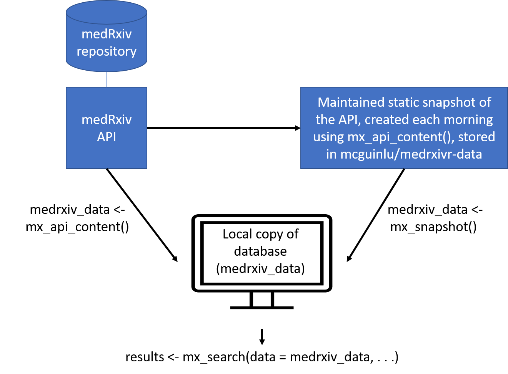

<!-- README.md is generated from README.Rmd. Please edit that file -->

# medrxivr 

<!-- badges: start -->

[](https://www.repostatus.org/#active)
[](https://github.com/ropensci/software-review/issues/380)
[](https://doi.org/10.21105/joss.02651)
[](https://cran.r-project.org/web/packages/medrxivr/index.html)
<br> [](https://github.com/ropensci/medrxivr/actions)
[](https://travis-ci.com/ropensci/medrxivr)
[](https://codecov.io/gh/ropensci/medrxivr?branch=master)

<!-- badges: end -->

An increasingly important source of health-related bibliographic content
are preprints - preliminary versions of research articles that have yet
to undergo peer review. The two preprint repositories most relevant to
health-related sciences are [medRxiv](https://www.medrxiv.org/) and
[bioRxiv](https://www.biorxiv.org/), both of which are operated by the
Cold Spring Harbor Laboratory.

The goal of the `medrxivr` R package is two-fold. In the first instance,
it provides programmatic access to the [Cold Spring Harbour Laboratory
(CSHL) API](https://api.biorxiv.org/), allowing users to easily download
medRxiv and bioRxiv preprint metadata (e.g. title, abstract, publication
date, author list, etc) into R. The package also provides access to a
maintained static snapshot of the medRxiv repository (see [Data
sources](#medrxiv-data)). Secondly, `medrxivr` provides functions to
search the downloaded preprint records using regular expressions and
Boolean logic, as well as helper functions that allow users to export
their search results to a .BIB file for easy import to a reference
manager and to download the full-text PDFs of preprints matching their
search criteria.

## Installation

To install the stable version of the package from CRAN:

``` r
install.packages("medrxivr")
library(medrxivr)
```

You can install the development version of this package using:

``` r
devtools::install_github("ropensci/medrxivr")
library(medrxivr)
```

## Data sources

### medRxiv data

`medrixvr` provides two ways to access medRxiv data:

  - `mx_api_content(server = "medrxiv")` creates a local copy of all
    data available from the medRxiv API at the time the function is run.

<!-- end list -->

``` r
# Get a copy of the database from the live medRxiv API endpoint
preprint_data <- mx_api_content()  
```

  - `mx_snapshot()` provides access to a static snapshot of the medRxiv
    database. The snapshot is created each morning at 6am using
    `mx_api_content()` and is stored as CSV file in the [medrxivr-data
    repository](https://github.com/mcguinlu/medrxivr-data). This method
    does not rely on the API (which can become unavailable during peak
    usage times) and is usually faster (as it reads data from a CSV
    rather than having to re-extract it from the API). Discrepancies
    between the most recent static snapshot and the live database can be
    assessed using `mx_crosscheck()`.

<!-- end list -->

``` r
# Get a copy of the database from the daily snapshot
preprint_data <- mx_snapshot()  
```

The relationship between the two methods for the medRxiv database is
summarised in the figure below:



### bioRxiv data

Only one data source exists for the bioRxiv repository:

  - `mx_api_content(server = "biorxiv")` creates a local copy of all
    data available from the bioRxiv API endpoint at the time the
    function is run. **Note**: due to it’s size, downloading a complete
    copy of the bioRxiv repository in this manner takes a long time (\~
    1 hour).

<!-- end list -->

``` r
# Get a copy of the database from the live bioRxiv API endpoint
preprint_data <- mx_api_content(server = "biorxiv")
```

## Performing your search

Once you have created a local copy of either the medRxiv or bioRxiv
preprint database, you can pass this object (`preprint_data` in the
examples above) to `mx_search()` to search the preprint records using an
advanced search strategy.

``` r

# Perform a simple search
results <- mx_search(data = preprint_data,
                     query ="dementia")

# Perform an advanced search
topic1  <- c("dementia","vascular","alzheimer's")  # Combined with Boolean OR
topic2  <- c("lipids","statins","cholesterol")     # Combined with Boolean OR
myquery <- list(topic1, topic2)                    # Combined with Boolean AND

results <- mx_search(data = preprint_data,
                     query = myquery)
```

## Further functionality

### Export records identified by your search to a .BIB file

Pass the results of your search above (the `results` object) to the
`mx_export()` to export references for preprints matching your search
results to a .BIB file so that they can be easily imported into a
reference manager (e.g. Zotero, Mendeley).

``` r

mx_export(data = results,
          file = "mx_search_results.bib")
```

### Download PDFs for records returned by your search

Pass the results of your search above (the `results` object) to the
`mx_download()` function to download a copy of the PDF for each record
found by your search.

``` r

mx_download(results,        # Object returned by mx_search(), above
            "pdf/",         # Directory to save PDFs to 
            create = TRUE)  # Create the directory if it doesn't exist
```

## Accessing the raw API data

By default, the `mx_api_*()` functions clean the data returned by the
API for use with other `medrxivr` functions.

To access the raw data returned by the API, the `clean` argument should
set to `FALSE`:

``` r
mx_api_content(to_date = "2019-07-01", clean = TRUE)
```

See [this
article](https://docs.ropensci.org/medrxivr/articles/medrxiv-api.html#accessing-the-raw-api-data)
for more details.

## Detailed guidance

Detailed guidance, including advice on how to design complex search
strategies, is available on the [`medrxivr`
website.](https://docs.ropensci.org/medrxivr/)

## Linked repositories

See here for the [code used to take the daily
snapshot](https://github.com/mcguinlu/medrxivr-data) and [the code that
powers the `medrxivr` web
app](https://github.com/mcguinlu/medrxivr-app).

## Code of conduct

Please note that this package is released with a [Contributor Code of
Conduct](https://ropensci.org/code-of-conduct/). By contributing to this
project, you agree to abide by its terms.

## Disclaimer

This package and the data it accesses/returns are provided “as is”, with
no guarantee of accuracy. Please be sure to check the accuracy of the
data yourself (and do let me know if you find an issue so I can fix it
for everyone\!)
